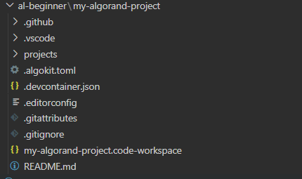

# Viết contract trên Al

## Cách cài đặt
Cài đặt AlgoKit trước:
```
pip install algokit
```
## Init dự án
Khởi tạo dự án mới với AlgoKit:
```
algokit init
```
Chọn smartcontract => chọn ngôn ngữ ta muốn viết (trong ví dụ này là python)
Đặt tên dự án (trong ví dụ này là `my-algorant-project`)
Default smartcontract app (trong ví dụ này là `hello_world`)
Template preset (trong ví dụ này là `Production`)
Ngôn ngữ (trong ví dụ này là python)
Các bước cuối nó hỏi muốn cài các gói và init env không thì ta có thể tự custom (trong ví dụ này mình yes hết)

Console terminal:


## Tổ chức workspace
Một dự án khởi tạo bởi AlgoKit thường có cấu trúc thư mục như sau:



## Viết smart contract bằng PyTeal
Trong thư mục `pyteal/`, ta có thể viết các smart contract bằng PyTeal.

```
# my_contract.py
from pyteal import *

def approval_program():
    return Approve()

def clear_state_program():
    return Approve()

if __name__ == "__main__":
    print(compileTeal(approval_program(), mode=Mode.Application, version=2))
    print(compileTeal(clear_state_program(), mode=Mode.Application, version=2))
```

## Biên dịch sc
Sau khi viết xong sc bằng PyTeal, ta có thể biên dịch nó sang TEAL.

```
python pyteal/my_contract.py > contracts/approval.teal
python pyteal/my_contract.py > contracts/clear.teal
```

## Deploy smartcontract

Ta có thể sử dụng Algorand SDK hoặc các công cụ khác để triển khai smartcontract đã biên dịch lên blockchain Algorand.

Ví dụ lệnh triển khai smart contract bằng Python SDK:
```
from algosdk import algod, transaction
from algosdk.v2client import algod

# Thông tin kết nối đến Algorand
algod_address = "http://localhost:4001"
algod_token = "youralgodtoken"

# Khởi tạo khách hàng Algorand
algod_client = algod.AlgodClient(algod_token, algod_address)

# Tạo giao dịch triển khai smartcontract
params = algod_client.suggested_params()
txn = transaction.ApplicationCreateTxn(
    sender=sender_address,
    sp=params,
    on_complete=transaction.OnComplete.NoOpOC.real,
    approval_program=approval_teal,
    clear_program=clear_teal,
    global_schema=global_schema,
    local_schema=local_schema,
)

# Ký và gửi giao dịch
signed_txn = txn.sign(sender_private_key)
tx_id = algod_client.send_transaction(signed_txn)
```

Updating...