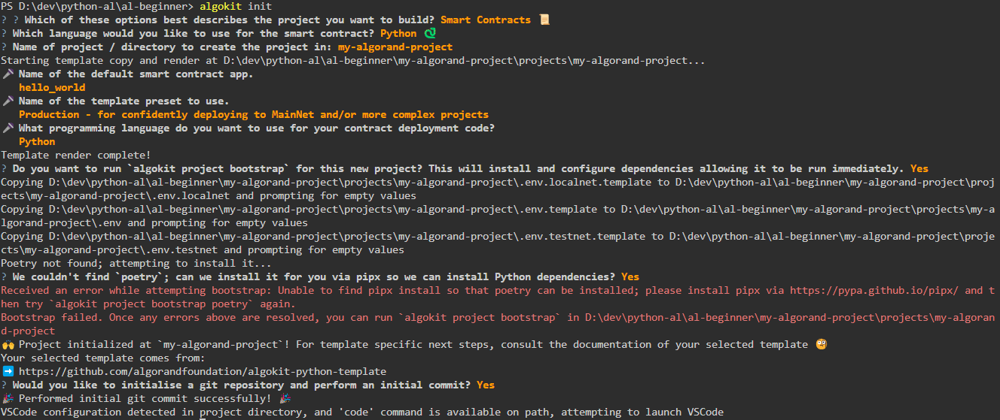
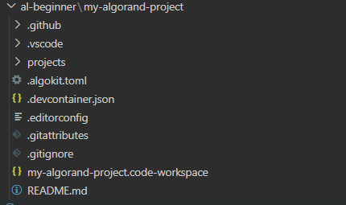

# Viết contract trên Al

## Cách cài đặt
Cài đặt AlgoKit trước:
```
pip install algokit
```
## Init dự án
Khởi tạo dự án mới với AlgoKit:
```
algokit init
```
Chọn smartcontract => chọn ngôn ngữ ta muốn viết (trong ví dụ này là python)

Đặt tên dự án (trong ví dụ này là `my-algorant-project`)

Default smartcontract app (trong ví dụ này là `hello_world`)

Template preset (trong ví dụ này là `Production`)

Ngôn ngữ (trong ví dụ này là python)

Các bước cuối nó hỏi muốn cài các gói và init env không thì ta có thể tự custom (trong ví dụ này mình yes hết)

Console terminal:



## Tổ chức workspace
Một dự án khởi tạo bởi AlgoKit thường có cấu trúc thư mục như sau:



## Viết smart contract bằng PyTeal 
Trong thư mục `smart_contract/`, ta có thể viết các smart contract bằng Python.
Ta có contract init là `hello_world.py`
```
# hello_world.py
from algopy import ARC4Contract, arc4


class HelloWorld(ARC4Contract):
    @arc4.abimethod()
    def hello(self, name: arc4.String) -> arc4.String:
        return "Hello, " + name
```

và file `deploy_config.py`

```
# deploy_config.py
import logging

import algokit_utils
from algosdk.v2client.algod import AlgodClient
from algosdk.v2client.indexer import IndexerClient

logger = logging.getLogger(__name__)


# define deployment behaviour based on supplied app spec
def deploy(
    algod_client: AlgodClient,
    indexer_client: IndexerClient,
    app_spec: algokit_utils.ApplicationSpecification,
    deployer: algokit_utils.Account,
) -> None:
    from smart_contracts.artifacts.hello_world.client import (
        HelloWorldClient,
    )

    app_client = HelloWorldClient(
        algod_client,
        creator=deployer,
        indexer_client=indexer_client,
    )

    app_client.deploy(
        on_schema_break=algokit_utils.OnSchemaBreak.AppendApp,
        on_update=algokit_utils.OnUpdate.AppendApp,
    )
    name = "world"
    response = app_client.hello(name=name)
    logger.info(
        f"Called hello on {app_spec.contract.name} ({app_client.app_id}) "
        f"with name={name}, received: {response.return_value}"
    )

```

## Biên dịch sc

Hãy cài đặt pipx và poetry để quản lý các phụ thuộc Python của dự án.
```
python -m pip install --user pipx
python -m pipx ensurepath
pipx install poetry

```

Bootstrap dự án

Sau khi cài đặt `poetry`, bạn có thể chạy lại lệnh `algokit project bootstrap` để cài đặt và cấu hình.
```
from algopy import ARC4Contract, arc4


class HelloWorld(ARC4Contract):
    @arc4.abimethod()
    def hello(self, name: arc4.String) -> arc4.String:
        return "Hello, " + name


if __name__ == "__main__":
    import sys
    from algokit_utils import compile_program

    contract = HelloWorld()
    approval_teal, clear_teal = contract.compile()

    with open("artifacts/approval.teal", "w") as f:
        f.write(approval_teal)

    with open("artifacts/clear.teal", "w") as f:
        f.write(clear_teal)
```

`python smart_contracts/hello_world/contract.py`


Ta sẽ thực hiện các bước tiếp theo để biên dịch PyTeal và triển khai smart contract lên mạng Algorand.

File `deploy_config.py` của ta đã được viết để triển khai và gọi hàm `hello`. Đảm bảo rằng có các biến môi trường cần thiết trong .env được cấu hình đúng. Sau đó, ta có thể chạy deploy_config.py để triển khai smartcontract.

```
python deploy_config.py
```

Trước khi chạy `deploy_config.py`, hãy đảm bảo ta đã có cấu hình môi trường đúng. Các tệp .env nên chứa thông tin như `ALGOD_ADDRESS`, `ALGOD_TOKEN`, và `DEPLOYER_ACCOUNT`.

Updating...
